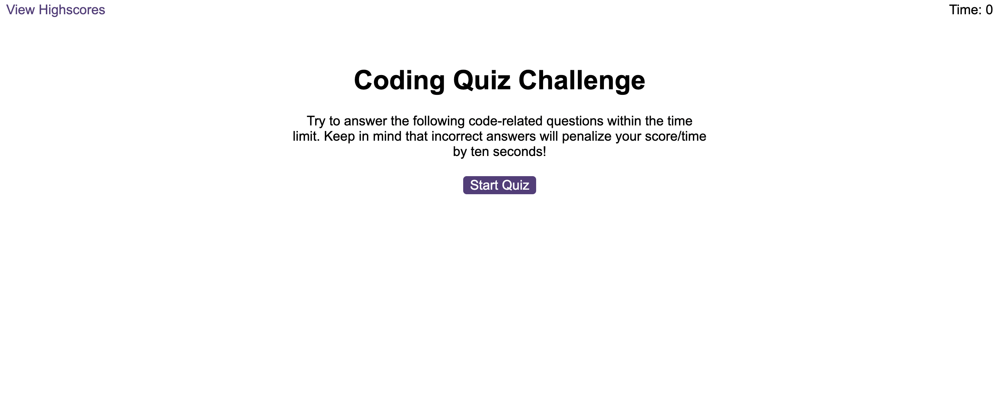

# Unit 6 - Challenge Web APIs: Code Quiz

## Description

A timed quiz on JavaScript fundamentals that stores high scores using local storage

## Deployed Link

[Code Quiz](https://jkp1990.github.io/Module-6-Challenge-Web-APIs/)   

## Screenshot

## Usage

Simply click on the deploy link above.

## Credits

n/a

## License

License is MIT
